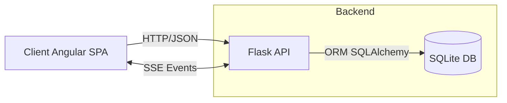
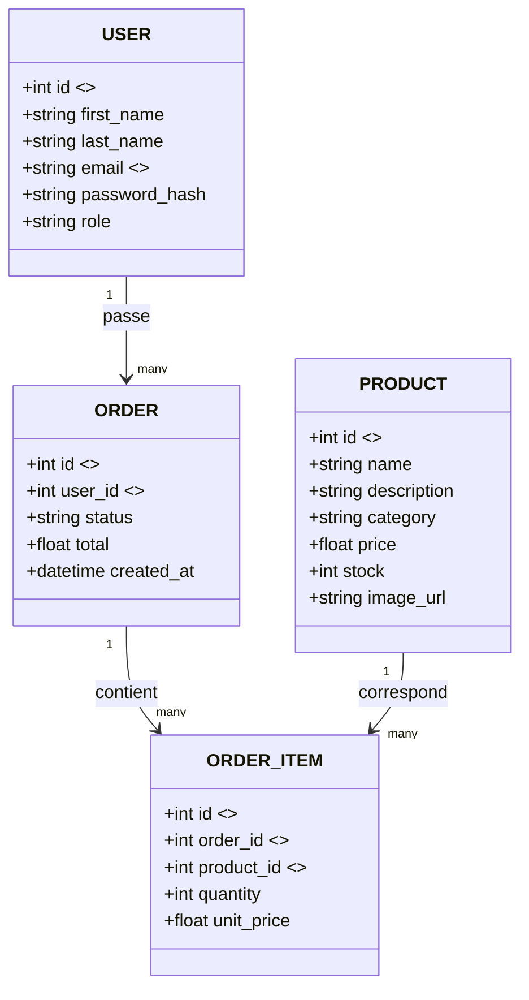

# Click & Collect Café IUT

MVP pédagogique pour commander cafés, boissons et viennoiseries.

Suivi en temps réel via **SSE** . Rôles **CLIENT/ADMIN** . Swagger disponible.

- **Année** : 2024–2025
- **Version** : v0.1.0
- **Base URL** : `/products`, `/orders`, `/auth`, `/users`

---

## Sommaire

1. [Aperçu](#1-apercu)
2. [Fonctionnalités](#2-fonctionnalités)
3. [Stack technique](#3-stack-technique)
4. [Architecture du projet](#4-architecture-du-projet)
5. [Modèle de données](#5-modèle-de-données)
6. [API REST &amp; Documentation Swagger](#6-api-rest--documentation-swagger)
7. [Temps réel (SSE)](#7-temps-réel-sse)
8. [Sécurité et rôles](#8-sécurité-et-rôles)
9. [Installation &amp; exécution](#9-installation--exécution)
10. [Configuration (.env)](#10-configuration-env)
11. [Migrations &amp; seed](#11-migrations--seed)
12. [Journalisation](#12-journalisation)
13. [Commandes utiles (dev)](#13-commandes-utiles-dev)
14. [Schéma BDD](#14-schéma-bdd)
15. [Conventions &amp; inline docs](#15-conventions--inline-docs)
16. [Tests](#16-tests)
17. [Format des erreurs](#17-format-des-erreurs)
18. [Dépannage](#18-dépannage)
19. [Traçabilité cahier des charges](#19-traçabilité-cahier-des-charges)
20. [Livrables](#20-livrables)
21. [Déploiement](#21-déploiement)
22. [Licence &amp; auteurs](#22-licence--auteurs)
23. [Conclusion](#23-conclusion)

---

## 1) Aperçu

- **Client** : catalogue, panier, commande, suivi d’état (SSE)
- **Admin** : CRUD produits, gestion commandes
- **Temps réel** : SSE commandes et stock

### Scénario rapide

1. Ouvrir la page Produits
2. Ajouter des articles
3. Valider → commande créée
4. Suivre `PREPARING → READY → CONSUMED`
5. Retirer la commande au comptoir

---

## 2) Fonctionnalités

**Client :**

- Parcourir, filtrer, ajouter au panier, suivre commande

**Admin :**

- CRUD produits (`name`, `description`, `category`, `price`, `stock`, `image_url`)
- Gérer commandes et statuts

Workflow actuel : `PREPARING → READY → CONSUMED`

---

## 3) Stack technique

Backend : Flask 3.1.2, SQLAlchemy, Pydantic v2, JWT, Flasgger

Frontend : Angular 19.1.x, Tailwind, RxJS

DB : SQLite locale

## Prérequis

- Python 3.11+
- Node.js 20+
- npm 10+
- Angular CLI 19
- SQLite (inclus)
  Ports par défaut : Flask → 5000, Angular → 4200

---

## 4) Architecture du projet

backend/
├─ app.py
├─ controllers/
├─ models/
├─ services/
├─ repositories/
├─ dtos/
├─ realtime/
├─ security/
├─ `<span>`shared /
└─ tests/
frontend/
└─ src/app/
├─ features/
├─ services/
└─ shared/

### Schéma d’architecture



### Choix techniques

- **SSE** pour la simplicité du push serveur→client
- **SQLAlchemy** pour l’ORM
- **Pydantic v2** pour la validation
- **JWT** pour l’auth stateless
- **Tailwind + Angular** pour rapidité d’UI

---

## 5) Modèle de données

| Entité             | Champs principaux                                        |
| ------------------- | -------------------------------------------------------- |
| **Product**   | id, name, description, category, price, stock, image_url |
| **Order**     | id, user_id, status, total, created_at                   |
| **OrderItem** | id, order_id, product_id, quantity, unit_price           |
| **User**      | id, first_name, last_name, email, password_hash, role    |

Règle stock : décrémentation blocage à 0.

---

## 6) API REST & Documentation Swagger

### Endpoints principaux

- Auth : `/auth/register`, `/auth/login`
- Produits : `/products` (GET/POST/PATCH/DELETE)
- Commandes : `/orders` (GET/POST/PATCH)
- SSE : `/orders/sse`, `/products/sse`

### Exemple

<pre class="overflow-visible!" data-start="3949" data-end="4133"><div class="contain-inline-size rounded-2xl relative bg-token-sidebar-surface-primary"><div class="sticky top-9"><div class="absolute end-0 bottom-0 flex h-9 items-center pe-2"><div class="bg-token-bg-elevated-secondary text-token-text-secondary flex items-center gap-4 rounded-sm px-2 font-sans text-xs"></div></div></div><div class="overflow-y-auto p-4" dir="ltr"><code class="whitespace-pre! language-json"><span><span>{</span><span>
  </span><span>"name"</span><span>:</span><span></span><span>"Café Latte"</span><span>,</span><span>
  </span><span>"description"</span><span>:</span><span></span><span>"Boisson douce"</span><span>,</span><span>
  </span><span>"category"</span><span>:</span><span></span><span>"Beverage"</span><span>,</span><span>
  </span><span>"price"</span><span>:</span><span></span><span>2.5</span><span>,</span><span>
  </span><span>"stock"</span><span>:</span><span></span><span>20</span><span>,</span><span>
  </span><span>"image_url"</span><span>:</span><span></span><span>"https://images.unsplash.com/photo..."</span><span>
</span><span>}</span><span>
</span></span></code></div></div></pre>

### Swagger

- UI : [http://localhost:5000/apidocs/](http://localhost:5000/apidocs/)
- JSON : `/apispec_1.json`
- YAML : `backend/docs/`
- Activation : `SWAGGER_ENABLED=true` dans `.env`

---

## 7) Temps réel (SSE)

- `/orders/sse` : `order_created`, `order_updated`
- `/products/sse` : `stock_updated`
- Pas d’auth pour le flux (à sécuriser plus tard)

---

## 8) Sécurité et rôles

- JWT (Flask-JWT-Extended)
- Hachage MDP (Flask-Bcrypt)
- Rôles CLIENT/ADMIN
- CORS `http://localhost:4200`
- Pas encore de restriction email `@iut.univ-paris8.fr`

---

## 9) Installation & exécution

### Backend

cd backend
python -m venv venv
.\venv\Scripts\activate # Windows
source venv/bin/activate # Linux/Mac
pip install -r requirements.txt

python app.py

    OU

flask run

### Frontend

cd frontend/app
npm install

npm start
OU directement :
ng serve

### URLs locales

- API : [http://localhost:5000](http://localhost:5000)
- Front : [http://localhost:4200](http://localhost:4200)
- Swagger : [http://localhost:5000/apidocs/](http://localhost:5000/apidocs/)

### Comptes de test

- Admin : [admin@iut.univ-paris8.fr]() / admin1234
- Client : [etudiant@iut.univ-paris8.fr]() / etudiant1234 OU S'INSCRIRE

## backend/.env

FLASK_ENV=development
SECRET_KEY=changeme
JWT_SECRET_KEY=changeme
LOG_LEVEL=INFO
SWAGGER_ENABLED=true

---

## 10) Configuration (.env)

FLASK_ENV=development
SECRET_KEY=changeme
JWT_SECRET_KEY=changeme
LOG_LEVEL=INFO
SWAGGER_ENABLED=true

---

---

## 11) Migrations & seed

### Migration — ajout du champ `image_url`

Ce script mettais à jour la table **products** pour ajouter la colonne `image_url`
si elle n’existe pas encore dans la base SQLite.

```bash
python backend/scripts/2025_11_add_image_url.py
```

À exécuter **une seule fois** après avoir modifié le modèle `Product`

afin d’ajouter la nouvelle colonne à la base existante (`instance/app.db`).

### Seed — remplissage de la base avec des données de test

Le projet contient plusieurs **seeders indépendants** afin d’initialiser chaque table.

| Seeder       | Fichier                             | Description                                                                   |
| ------------ | ----------------------------------- | ----------------------------------------------------------------------------- |
| Utilisateurs | `backend/shared/seed_users.py`    | Crée un compte**admin**et un compte**client**                    |
| Produits     | `backend/shared/seed_products.py` | Insère**30 produits réels**(cafés, boissons, viennoiseries, snacks)  |
| Commandes    | `backend/shared/seed_orders.py`   | Crée une commande d’exemple liée au client                                 |
| Global       | `backend/shared/seed.py`          | Réinitialise la base (`drop_all`) puis exécute tous les seeders ci-dessus |

#### Commande complète :

<pre class="overflow-visible!" data-start="1261" data-end="1302"><div class="contain-inline-size rounded-2xl relative bg-token-sidebar-surface-primary"><div class="sticky top-9"><div class="absolute end-0 bottom-0 flex h-9 items-center pe-2"><div class="bg-token-bg-elevated-secondary text-token-text-secondary flex items-center gap-4 rounded-sm px-2 font-sans text-xs"></div></div></div><div class="overflow-y-auto p-4" dir="ltr"><code class="whitespace-pre! language-bash"><span><span>python backend/shared/seed.py
</span></span></code></div></div></pre>

#### Exemple de résultat :

| Table              | Données créées                                                             |
| ------------------ | ----------------------------------------------------------------------------- |
| **users**    | 2 utilisateurs (`admin@iut.univ-paris8.fr`,`etudiant@iut.univ-paris8.fr`) |
| **products** | 30 produits variés avec images Unsplash                                      |
| **orders**   | 1 commande test associée au compte client                                    |

> exécuter à nouveau `seed.py` pour regénérer la base.

---

## 12) Journalisation

- **success.log** : événements normaux
- **error.log** : erreurs API (400–500)

  Rotation activée, niveau via `LOG_LEVEL`.

---

## 13) Commandes utiles (dev)

python backend/app.py
pytest -q
npm --prefix frontend/app install
npm --prefix frontend/app start

---

## 14) Schéma BDD



### Table résumé

products(id PK, name, description, category, price, stock, image_url)
users (id PK, first_name, last_name, email UNIQUE, password_hash, role)
orders (id PK, user_id FK->users.id, status, total, created_at)
order_items (id PK, order_id FK->orders.id, product_id FK->products.id, quantity, unit_price)

---

## 15) Conventions & inline docs

- Nommage explicite, pas d’abréviations
- Types indiqués (Python/TS)
- Commenter quand nécessaire le **pourquoi** , pas le **comment.**

---

## 16) Tests

Aucun test unitaire demandé.

Tests manuels/intégration réalisés :

- Auth (login/register)
- CRUD produits
- Commandes et SSE
- Vérification logs & Swagger

> Pour ajouter des tests auto : `pytest` avec SQLite mémoire.

---

## 17) Format des erreurs

Le backend intercepte les exceptions Flask et Pydantic et renvoie toujours une réponse structurée :

```json
{
  "error": {
    "code": 404,
    "message": "Resource not found"
  }
}
```

- 400 → Validation échouée
- 401/403 → Authentification/autorisation
- 404 → Ressource inexistante
- 409 → Stock insuffisant / Conflit

---

## 18) Dépannage

Quelques problèmes qui nous arrivait :

- **CORS** → adapter l’origine autorisée
- **DB absente** → lancer une fois l’app pour créer `instance/app.db`

---

## 19) Traçabilité cahier des charges

| Exigence             | État | Emplacement                             |
| -------------------- | ----- | --------------------------------------- |
| CRUD produits        | OK    | `controllers/products_*`              |
| URL image produit    | OK    | `product_model.py`,`product_dto.py` |
| Commandes + statuts  | OK    | `order_controllers.py`                |
| Pagination commandes | OK    | `order_service.py`                    |
| Auth + rôles        | OK    | JWT                                     |
| SSE admin/client     | OK    | `/orders/sse`,`/products/sse`       |
| Logs séparés       | OK    | `logs/success.log`,`logs/error.log` |
| Restriction email    | OK    | `dtos/user_dto.py`                    |

---

## 20) Livrables

- [X] Code complet (front/back)
- [X] README + Swagger
- [X] Logs séparés
- [X] Auth et rôles
- [X] Pagination commandes
- [X] Restriction domaine e-mail

---

## 21) Déploiement

- Local par défaut
- Production : `SWAGGER_ENABLED=false`, `LOG_LEVEL=WARNING`
- Pour Docker : exposer port 5000 et définir `DATABASE_URL`

```markdown
> En production :
>
> - Désactiver Swagger (`SWAGGER_ENABLED=false`)
> - Réduire la verbosité des logs (`LOG_LEVEL=WARNING`)
> - Fournir `DATABASE_URL` et `JWT_SECRET_KEY` via variables d’environnement
```

---

## 22) Licence & auteurs

- **Licence** : MIT (Projet Académique)
- **Auteurs** : MERIDJA Kyllian, PEMBELE Exaucé, BOUQSI Karim

---

## 23) Conclusion

Cette version couvre toutes les exigences fonctionnelles :

authentification, gestion produits, commandes et SSE.

Prochaines étapes éventuelles : déploiement Docker & ajouts de features bonus selon les idées.

---

README.md rédigé par Kyllian Meridja.

---
